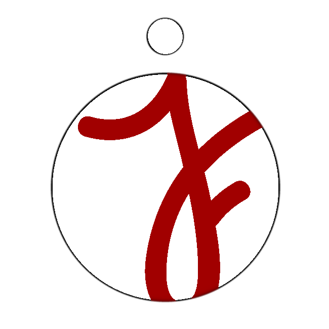

<!-- PROJECT LOGO -->
<br />
<p align="center">
  <a href="https://github.com/Jfloresvid/portfolio">
    
  </a>

  <h3 align="center">JF Portfolio Project</h3>

  <p align="center">
    A web page that shows the professional and educational history of Juan Flores 
    <br />
    <a href="https://github.com/Jfloresvid/portfolio"><strong>Explore the docs »</strong></a>
    <br />
    <br />
    <a href="https://Jfloresvid.github.io/portfolio">View Page</a>
    ·
    <a href="https://github.com/Jfloresvid/portfolio/issues">Report Bug</a>
    ·
    <a href="https://github.com/Jfloresvid/portfolio/issues">Request Feature</a>
  </p>
</p>

<!-- TABLE OF CONTENTS -->
<details open="open">
  <summary>Table of Contents</summary>
  <ol>
    <li>
      <a href="#about-the-project">About The Project</a>
      <ul>
        <li><a href="#built-with">Built With</a></li>
      </ul>
    </li>
    <li>
      <a href="#getting-started">Getting Started</a>
      <ul>
        <li><a href="#prerequisites">Prerequisites</a></li>
        <li><a href="#installation">Installation</a></li>
      </ul>
    </li>
    <li><a href="#usage">Usage</a></li>
    <li><a href="#license">License</a></li>
    <li><a href="#contact">Contact</a></li>
    <li><a href="#acknowledgements">Acknowledgements</a></li>
  </ol>
</details>

<!-- ABOUT THE PROJECT -->

## About The Project

[![Product Name Screen Shot][product-screenshot]](https://Jfloresvid.github.io/portfolio)

This project is a webpage shows the history, skills, projects and contact data of Juan Flores.

### Built With

The major frameworks that use in this project are:

- [ReactJS](https://reactjs.org/)
- [Tailwind CSS](https://tailwindcss.com/)

<!-- GETTING STARTED -->

## Getting Started

To get a local copy up and running this project follow these simple example steps.

### Prerequisites

This is an list things you need to running the project and how to install them.

- latest version of npm

  ```sh
  npm install npm@latest -g
  ```

### Installation

1. Clone the repo
   ```sh
   git clone https://github.com/Jfloresvid/portfolio.git
   ```
2. Install NPM packages

   - utilities of react

     ```sh
     npm install --save react-router
     npm install --save react-router-dom
     npm install react-responsive --save
     ```

   - github

     ```sh
     npm install --save-dev gh-pages
     ```

   - Tailwind CSS

     ```sh
     npm install -D tailwindcss@npm:@tailwindcss/postcss7-compat postcss@^7 autoprefixer@^9
     npm install @craco/craco
     ```

   - Font Awesome

     ```sh
     npm i --save @fortawesome/fontawesome-svg-core
     npm install --save @fortawesome/free-solid-svg-icons
     npm install --save @fortawesome/react-fontawesome
     npm install --save @fortawesome/free-brands-svg-icons
     npm install --save @fortawesome/free-regular-svg-icons
     ```

   - utilities of postcss

     ```sh
     npm install postcss-import
     npm install cssnano --save-dev
     ```

3. Running the project according to the next section

## Usage

In the project directory, you can run:

- ### `npm start`

  Runs the app in the development mode.\
  Open [http://localhost:3000/portfolio](http://localhost:3000/porfolio) to view it in the browser.

- ### `npm test`

  Launches the test runner in the interactive watch mode.

- ### `npm run build`

  Builds the app for production to the `build` folder.\
  It correctly bundles React in production mode and optimizes the build for the best performance.

- ### `npm run eject`

  **Note: this is a one-way operation. Once you `eject`, you can’t go back!**

  If you aren’t satisfied with the build tool and configuration choices, you can `eject` at any time. This command will remove the single build dependency from your project.

<!-- CONTACT -->

## Contact

Juan Flores - [LinkedIn](https://www.linkedin.com/in/jfloresvid) - j.floresvid@gmail.com

<!-- ACKNOWLEDGEMENTS -->

## Acknowledgements

- [GitHub Pages](https://pages.github.com)
- [Font Awesome](https://fontawesome.com)

[product-screenshot]: src/images/home.png
